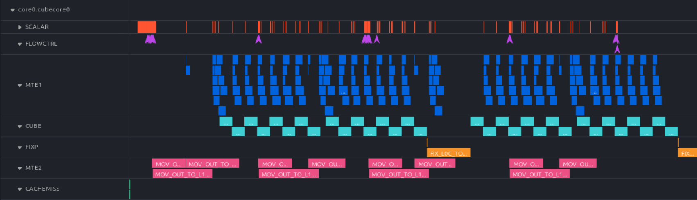
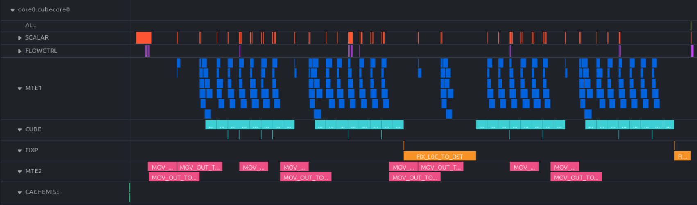
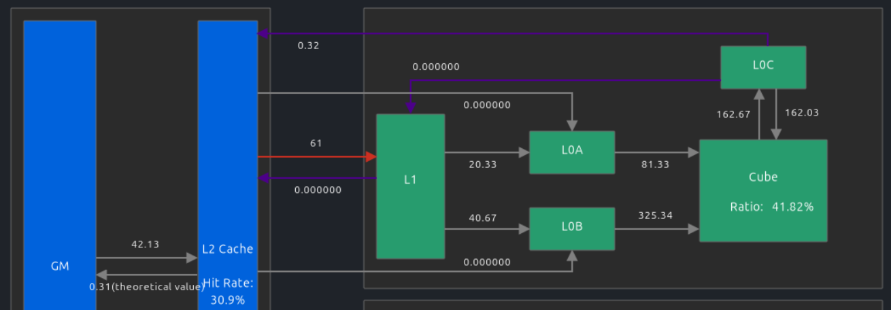

# NPU Matmul kernel from scratch -- reaching CANN library performance using 100 lines of Python <br/>(step-by-step optimization guide using PTO-ISA)

- Date: 2026/03/12
- Author: Jiawei Zhuang
- Contributor: Filip Skogh, Mirko De Vita, Hyun Min Chang

# Outline

- [Motivation](#motivation)
- [Step 0: NPU programming crash course for CUDA/triton programmers](#step-0-npu-programming-crash-course-for-cudatriton-programmers)
  - [Typical kernel launch syntax](#typical-kernel-launch-syntax)
  - [Auto vs manual software pipelining](#auto-vs-manual-software-pipelining)
- [Step 1: functionally-correct naive version](#step-1-functionally-correct-naive-version)
- [Step 2: double buffering](#step-2-double-buffering)
- [Step 3: "Swizzling" for L2 cache reuse](#step-3-swizzling-for-l2-cache-reuse)
- [Step 4: (optional) manual software pipelining](#step-4-optional-manual-software-pipelining)
- [Appendix A: PTO-DSL syntax note](#appendix-a-pto-dsl-syntax-note)
- [Appendix B: Using msprof](#appendix-b-using-msprof)

# Motivation

This guide is the NPU version of "step-by-step Matmul optimization", a popular article style for Nvidia GPUs (e.g. [for A100](https://siboehm.com/articles/22/CUDA-MMM) and [for H100](https://cudaforfun.substack.com/p/outperforming-cublas-on-h100-a-worklog), but never written for our NPUs before.

I intentionally keep the code samples **minimum, low-level, from-scatch, without magical templates and wrappers**. After going through this guide, the readers will be more prepared for more complex "Matmul optimization practices" [in catlass](https://gitcode.com/cann/catlass/blob/master/docs/contents/advanced/matmul_template_summary.md) or [in AscendC](https://www.hiascend.com/document/detail/zh/canncommercial/850/opdevg/Ascendcopdevg/atlas_ascendc_best_practices_10_10006.html) (which hide all optimization tricks behind templates and wrappers)

We will compare our custom kernel's performance to `torch.matmul` that invokes [aclnnMatmul](https://www.hiascend.com/document/detail/zh/canncommercial/850/API/aolapi/context/ops-nn/aclnnMatmul.md) (our "cuBLAS" for NPU), internally implemented by [many thousands of lines of AscendC](https://gitcode.com/cann/ops-nn/tree/v8.5.0/matmul/mat_mul_v3/op_kernel). We show step-by-step to how match the performance of such carefully-optimized library, using only ~100 lines of Python DSL.

**To reproduce all results shown in this guide**, see commands in [README.md](./README.md)

# Step 0: NPU programming crash course for CUDA/triton programmers

(jump to next section if you've programmed NPU kernels before)

## Typical kernel launch syntax

The [SPMD](https://en.wikipedia.org/wiki/Single_program,_multiple_data)-style kernels on NPU look **deceptively similar** to CUDA/triton kernel syntax:
- The `block_idx` and `block_num` built-in variables to assist offset calculation for each core -- [example here](https://github.com/huawei-csl/pto-dsl/blob/7f8176a648c7c4ca03b09bd75f8b615d4bac0eaf/examples/jit/add_dynamic_multicore/run_add.py#L46-L51)
- The CUDA-style `kernel_name<<<block_dim>>>(args)` kernel launch -- [example here](https://github.com/huawei-csl/pto-dsl/blob/7f8176a648c7c4ca03b09bd75f8b615d4bac0eaf/examples/aot/add_dynamic_multicore/caller.cpp#L11)

However, there is an important difference: all NPU kernels are ["persistent kernel"](https://triton-lang.org/main/getting-started/tutorials/09-persistent-matmul.html) in CUDA terminology, i.e. the `block_dim` is forced to be the number of cores, instead of growing with the input data size.

Check this [PTO dynamic-shape vector-add example](https://github.com/huawei-csl/pto-dsl/blob/d923ac2ed3c1a2180475c1d279699ea952022e77/examples/jit/add_dynamic_multicore/run_add.py#L46-L100) -- each cores calculates its own global memory offsets and subset data sizes, and the number of iterations [depends on the dynamic input size](https://github.com/huawei-csl/pto-dsl/blob/d923ac2ed3c1a2180475c1d279699ea952022e77/examples/jit/add_dynamic_multicore/run_add.py#L83). 

This is **unlike** conventional ("non-persistent") CUDA/triton kernels, where a data-dependent `block_dim` handles the dynamic input size. For example, unlike [triton vector add](https://triton-lang.org/main/getting-started/tutorials/01-vector-add.html#compute-kernel) that sets `grid = (ceil_div(n_elements, BLOCK_SIZE),)`, most of our NPU kernels (no matter written in PTO, AscendC, CCE, whatever) always have `grid = (num_cores,)`.

(data-dependent large `block_dim` *might* work for simple cases on NPU, but it can often hit bugs during Cube-Vector synchronization, and also overflows if `block_dim > 65536` -- a bug [that we fixed](https://github.com/huawei-csl/pto-kernels/pull/39) by switching to persistent kernel style)

## Auto vs manual software pipelining

NPU uses [scratchpad memory](https://en.wikipedia.org/wiki/Scratchpad_memory) instead of hardware-managed cache, thus [data hazards](https://en.wikipedia.org/wiki/Hazard_(computer_architecture)#Data_hazards) must be avoided by the programmer/software using [set_flag & wait_flag APIs](https://www.hiascend.com/document/detail/zh/CANNCommunityEdition/850/API/cceintrinsicapi/cceapi_0106.html), essentially a [binary semaphore](https://en.wikipedia.org/wiki/Semaphore_(programming)#Producer%E2%80%93consumer_problem) synchronization mechanism. The closest analogy in CUDA is [all the `cp.async` stuff](https://docs.nvidia.com/cuda/cuda-programming-guide/04-special-topics/async-copies.html) that needs manual wait.

See this [manually-synchronized vector-add example](https://github.com/PTO-ISA/pto-isa/blob/5de2d24d53e8cf39dec5fc11f997d1e74fa7190c/demos/torch_jit/add/add_custom.cpp#L78-L115). For complex fused kernels like FlashAttention, manual synchronization can be hard to reason about.

To solve this headache, [PTO-DSL](https://github.com/huawei-csl/pto-dsl) offers automatic synchronization, internally achieved by the [InsertSync](https://github.com/zhangstevenunity/PTOAS/tree/8eb9e23fa95e18c3db789e0a171a98df07a8a846/lib/PTO/Transforms/InsertSync) compile pass based on [PTO MLIR dialect](https://github.com/zhangstevenunity/PTOAS/blob/8eb9e23fa95e18c3db789e0a171a98df07a8a846/docs/PTO_IR_manual.md). The kernel code still looks "sequential" (in pipelining sense), similar to writing Triton code or CuTile code.

# Step 1: functionally-correct naive version

According to our [NPU hardware architecture](https://www.hiascend.com/document/detail/zh/CANNCommunityEdition/850/opdevg/Ascendcopdevg/atlas_ascendc_10_0008.html), an Matmul operation requires such movement across memory hierarchy:
- GM (global memory) -> L1 -> L0 (L0A and L0B for left- and right- operands) -> Cube core -> L0C -> GM 

The on-chip tile size is bounded by the L1/L0 buffer size constraint. The buffer size can be found in `${ASCEND_HOME_PATH}/arm64-linux/data/platform_config` in any CANN-installed environment:

```bash
grep -A 9 "AICoreSpec" ${ASCEND_HOME_PATH}/arm64-linux/data/platform_config/Ascend910B2.ini
```

gives:

```
[AICoreSpec]
...
l0_a_size=65536  # 64 KiB
l0_b_size=65536  # 64 KiB
l0_c_size=131072  # 128 KiB
l1_size=524288  # 512 KiB
```

Consider `C = A @ B`, for each tile (subset) of A/B/C, we choose the tile size for  as follows:
- Allocate KiB for 
- 
- 

(This is a common tiling choice [in ATB's matmul](https://gitcode.com/cann/ascend-transformer-boost/blob/br_release_cann_8.5.0_20260527/src/kernels/kernels/matmul/pp_matmul_f16_kernel/op_kernel/pp_matmul.cce?init=initTree), but many other choices also work as long as they fit into buffer)

See [step1_baseline_numpy_sim.py](./step1_baseline_numpy_sim.py) for the full "numpy emulation code" that hightlights the algorithm logic.

Then, we just translate this numpy emulation code into equivalent PTO-DSL code [step1_baseline.py](./step1_baseline.py) and [common_utils.py]([common_utils.py]). The PTO code logic largely follows the numpy emulation, with a few DSL-specific syntax details explained in [Appendix A: PTO-DSL syntax note](#appendix-a-pto-dsl-syntax-note)

The PTO generates numerically correct result on NPU, but the performance is only 50% of `torch.matmul` reference. We will close the gap in the next section.


Extra references:
- More on [NPU hardware spec](https://www.hiascend.com/document/detail/zh/CANNCommunityEdition/850/opdevg/Ascendcopdevg/atlas_ascendc_10_0011.html)
- The full supported matmul shapes and dtypes in [`TMATMUL`](https://gitcode.com/cann/pto-isa/blob/master/docs/isa/TMATMUL.md?init=initTree) or equivalently [`Mmad` instruction](https://www.hiascend.com/document/detail/zh/CANNCommunityEdition/850/API/ascendcopapi/atlasascendc_api_07_0249.html).

# Step 2: double buffering

Profiling our previous kernel with `msprof op simulator`:

```bash
msprof op simulator --aic-metrics=PipeUtilization \
    --kernel-name="_Z28matmul_kernel_step1_baselinePDhS_S_iii_mix_aic" \
    --output="msprof_res" --launch-count=5 \
    python ./run_matmul.py --variant step1-baseline
```

(see [Appendix B: Using msprof](#appendix-b-using-msprof) for more profiler usage details)

We see that the Cube core is idle for 50% of time:



Double buffering to overlap compute and L1->L0 transfer:




See full code in [./step2_doublebuffer.py](./step2_doublebuffer.py).

Profiling by:

```bash
msprof op simulator --aic-metrics=PipeUtilization \
    --kernel-name="_Z26matmul_kernel_ABt_autosyncPDhS_S_iii_mix_aic" \
    --output="msprof_res" --launch-count=5 \
    python ./run_matmul.py --variant step2-doublebuffer
```

The only difference is that we allocates 2x local buffers for A and B, on both L1 and L0:

```python
a_l1 = [pto.alloc_tile(tile_buf_a_l1), pto.alloc_tile(tile_buf_a_l1)]
b_l1 = [pto.alloc_tile(tile_buf_b_l1), pto.alloc_tile(tile_buf_b_l1)]
a_l0 = [pto.alloc_tile(tile_buf_a_l0), pto.alloc_tile(tile_buf_a_l0)]
b_l0 = [pto.alloc_tile(tile_buf_b_l0), pto.alloc_tile(tile_buf_b_l0)]
```

and alternate between the "odd" and "even" buffers across iterations.

Now the FLOPs is doubled for not-so-large matrices:


For large-enough matrices such as 16384x16384, the FLOPs **suddenly drops**, because the NPU L2 cache is not large enough to hold the entire matrix, and the data is being evicted from cache.

We can check the L2 cache size by:

```bash
grep -A 8 "SoCInfo" ${ASCEND_HOME_PATH}/arm64-linux/data/platform_config/Ascend910B2.ini
```

gives:

```
[SoCInfo]
ai_core_cnt=24
cube_core_cnt=24
vector_core_cnt=48
ai_cpu_cnt=6
memory_type=
memory_size=68719476736  # 64 GiB
l2_type=0
l2_size=201326592  # 192 MiB
```

8192x8192 matrix (64 MiB in float16) is smaller than L2, but 16384x16384 matrix (256 MiB in float16) is larger than L2, thus we see the worse performance.

For `910B4`, both HBM size and L2 cache size are smaller by half (thus the cache eviction effect happens for smaller matrices):

```bash
grep -A 8 "SoCInfo" ${ASCEND_HOME_PATH}/arm64-linux/data/platform_config/Ascend910B4.ini
```

```
[SoCInfo]
ai_core_cnt=20
cube_core_cnt=20
vector_core_cnt=40
ai_cpu_cnt=6
memory_type=
memory_size=34359738368  # 32 GiB
l2_type=0
l2_size=100663296  # 96 MiB
```

# Step 3: "Swizzling" for L2 cache reuse

[step3_swizzle.py](./step3_swizzle.py) takes one of the swizzle scheme [from catlass](https://gitcode.com/cann/catlass/blob/v1.4.0/include/catlass/gemm/block/block_swizzle.hpp), while keeping the rest of code unchanged. [step3_swizzle_numpy_sim.py](./step3_swizzle_numpy_sim.py) explains the swizzle scheme intuitively.

profiling with `msprof op`:

```bash
msprof op \
    --aic-metrics=Occupancy,Roofline,Default,L2Cache,PipeUtilization,MemoryL0 \
    '--kernel-name="_Z26matmul_kernel_ABt_autosyncPDhS_S_iii_mix_aic" \
    --output="msprof_res" --launch-count=5 \
    python ./run_matmul.py --variant step2-doublebuffer
```





Now the FLOPs is much improved, getting ~90% of the `torch.matmul`


# Step 4: (optional) manual software pipelining

The last 10% performance gap can be squeezed-out by manual software pipelining [./step4_manual_pipelining.py](./step4_manual_pipelining.py).


Manually arranging synchronization is out of scope for this guide. We are [investigating the compile pass](https://github.com/zhangstevenunity/PTOAS/issues/226) so that the compiler-inserted sync can eventually reach manual performance.

# Appendix A: PTO-DSL syntax note


# Appendix B: Using msprof


How to find kernel name, first run `msprof op` without `--kernel-name=` arg

```bash

```

then it will print:

```
```


UI download links, originally from https://www.hiascend.com/developer/download/community/result?module=sto

```bash
# Windows x86
wget https://ascend-repo.obs.cn-east-2.myhuaweicloud.com/MindStudio/MindStudio%208.3.0/MindStudio-Insight_8.3.0_win.exe

# Mac arm and x86
wget https://ascend-repo.obs.cn-east-2.myhuaweicloud.com/MindStudio/MindStudio%208.3.0/MindStudio-Insight_8.3.0_darwin-aarch64.dmg
wget https://ascend-repo.obs.cn-east-2.myhuaweicloud.com/MindStudio/MindStudio%208.3.0/MindStudio-Insight_8.3.0_darwin-x86_64.dmg

# Linux arm and x86
wget https://ascend-repo.obs.cn-east-2.myhuaweicloud.com/MindStudio/MindStudio%208.3.0/MindStudio-Insight_8.3.0_linux-aarch64.zip
wget https://ascend-repo.obs.cn-east-2.myhuaweicloud.com/MindStudio/MindStudio%208.3.0/MindStudio-Insight_8.3.0_linux-x86_64.zip
```


